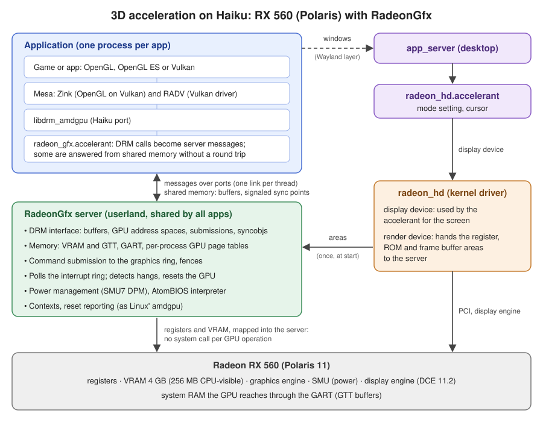

# RadeonGfx — Polaris development fork

Fork of [X547/RadeonGfx](https://github.com/X547/RadeonGfx), a userland GPU
server that lets Mesa's RADV Vulkan driver run on Haiku. The upstream code
supports Southern Islands (GFX6) GPUs.

The `polaris` branch adds support for Polaris (GFX8, Radeon RX 460/560),
working together with the patched `radeon_hd` display driver from
[jwalds/haiku-radeon-polaris](https://github.com/jwalds/haiku-radeon-polaris),
which also holds the build scripts, the Mesa and libdrm patches, the test
runner and the development log (`docs/test-log.md`, `docs/phase3-plan.md`).

## Status

Vulkan, OpenGL and OpenGL ES run hardware accelerated on a Radeon RX 560
(Polaris 11, `1002:67ef`): Vulkan through Mesa RADV, OpenGL and OpenGL ES
through Zink on top of RADV. glmark2 off-screen scores 4221, faster than
Mesa's Zink on Linux on the same machine (3314) and at 85% of Linux'
native radeonsi driver (`docs/perf/comparison.md` in haiku-radeon-polaris).

What works on Polaris:

- memory: VRAM and GTT buffers, GART, a GPU page table per process (VMIDs),
  CPU mapping of buffers
- command submission on the graphics ring, SDMA, fences, timeline and
  binary syncobjs, contexts
- several applications at once
- power management: SMU7 DPM (engine 214-1200 MHz, memory up to
  1500 MHz), the VBIOS memory controller setup through the AtomBIOS
  interpreter
- GPU hang detection and recovery as on Linux (soft recovery, then a
  graphics engine reset; the guilty context is told it lost its device)
- leak diagnostics when an application exits

Not supported or not done yet:

- interrupts: the server polls the GPU's interrupt ring (every 250 us)
- video decode and encode (UVD, VCE), compute-only queues
- display through the server: `radeon_hd` drives the screen, the server's
  own display code (DCE 6) is not built for Polaris
- only Polaris 11 has been tested; the Southern Islands code from upstream
  is still there but untested on this branch

## How it works



The kernel driver `radeon_hd` keeps driving the screen. Next to the display
device it publishes a render device that hands the GPU's register, ROM and
frame buffer areas to the RadeonGfx server once, at start; from then on the
server drives the GPU through those mappings. The server offers the
interface of Linux' amdgpu DRM driver: an application runs Mesa as on Linux,
libdrm_amdgpu calls the client accelerant (`radeon_gfx.accelerant`), which
turns the calls into messages to the server. Buffers are shared memory
between the application and the server.

## Building and installing on Haiku

You need Haiku x86_64 with the development tools (`gcc`, `git`, `meson`,
`ninja`). Mesa also needs Python 3.10 with Mako and the Wayland development
files; if `meson setup` stops at a missing dependency, install the package
it names with `pkgman`.

1. **The patched `radeon_hd` driver.** Build and install it as described in
   the haiku-radeon-polaris README; patch 0012 adds the render device the
   server needs. Reboot.

2. **The GPU stack.** Clones and builds the helper libraries (Locks,
   SADomains, ThreadLink), libdrm, libdrm2, accelerant2 and this repository
   (branch `polaris`) into `~/gpu`, installing into `~/gpu/install`:

   ```sh
   git clone https://github.com/jwalds/haiku-radeon-polaris.git
   ~/haiku-radeon-polaris/tools/build-gpu-stack.sh
   ```

3. **Mesa** (RADV and Zink, Mesa 23.3.6 with our patches), and optionally
   glmark2 for testing:

   ```sh
   ~/haiku-radeon-polaris/tools/build-mesa.sh
   ~/haiku-radeon-polaris/tools/build-glmark2.sh
   ```

4. **The client accelerant.** Applications load it from the user add-ons:

   ```sh
   mkdir -p ~/config/non-packaged/add-ons/accelerants
   cp ~/gpu/RadeonGfx/build.x86_64/radeon_gfx.accelerant/radeon_gfx.accelerant \
       ~/config/non-packaged/add-ons/accelerants/
   ```

After changing the code, rebuild with `ninja -C ~/gpu/RadeonGfx/build.x86_64`
and copy the accelerant again.

## Running

Start the server from its build directory (it loads the firmware from
`firmware/` in this repository) and wait for `Polaris ready`; Ctrl+C stops
it and halts the GPU:

```sh
~/gpu/RadeonGfx/build.x86_64/RadeonGfx server
```

Applications need Mesa from `~/gpu/install`:

```sh
export MESA_LOADER_DRIVER_OVERRIDE=zink
export LIBGL_DRIVERS_PATH=~/gpu/install/lib/dri
export VK_DRIVER_FILES=~/gpu/install/data/vulkan/icd.d/radeon_icd.x86_64.json
export LIBRARY_PATH=~/gpu/install/lib:$LIBRARY_PATH
~/gpu/install/bin/glmark2-es2-wayland
```

`tools/vktest/vkrun.sh <program>` in haiku-radeon-polaris does both: it
starts the server if needed, sets the environment and runs the program.

Other commands of the `RadeonGfx` binary: `info` (read-only probe of the
GPU), `clocks` (DPM state), `regs <list>` (register dump), and the self
tests `memtest`, `garttest`, `ihtest`, `sdmatest`, `gfxtest`. The test runner
`tools/test/run-tests.sh` in haiku-radeon-polaris runs these, Vulkan and
OpenGL clients, image comparisons, leak and hang tests.

Environment variables of the server: `RADEONGFX_LOCKUP_TIMEOUT` (ms before
a GPU job counts as hung, default 10000), `RADEONGFX_STATS` (per-call
times), `RADEONGFX_TRACE` (log every request).

## License

The upstream repository has no license file, so the original code remains
under its author's copyright. This fork is a personal development copy; a
license has been requested upstream. Do not redistribute modified versions
until that is resolved. The firmware in `firmware/` is AMD's, under
`firmware/LICENSE.amdgpu`.

## AI note

The changes on the `polaris` branch are developed with AI assistance.
